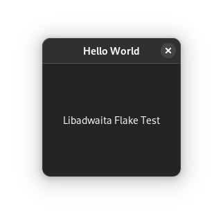

# libadwaita-flake

> The future is now, old man.

Uses the latest Nix Flake technology in combination with the meson build system to compile and package a minimal <q>hello world</q> using libadwaita.

